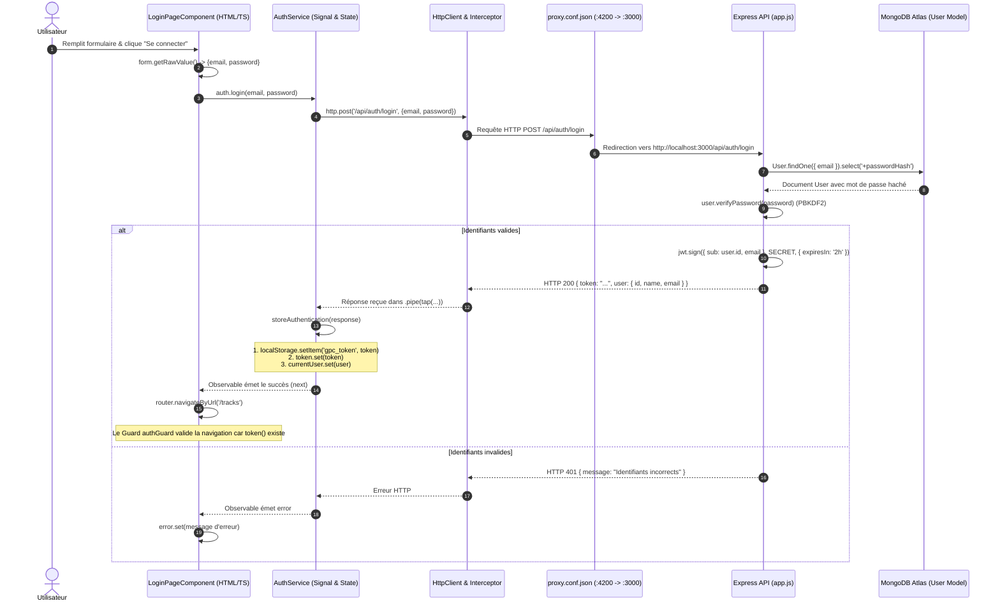

# Rapport TP1 — Architecture Authentification et Profil
**Guitar Practice Cloud — Package Étudiant M1 MIAGE**

---

## Mission 0 — Cartographier l'application

### 1. Cartographie de l'Application

#### 1.1. Point d'entrée et composant racine
- **Point d'entrée du bootstrap** : [`frontend-starter/src/main.ts`](frontend-starter/src/main.ts)
  - Utilise `bootstrapApplication(AppComponent, options)` spécifique aux architectures Angular standalone modernes (Angular 22).
  - Enregistre les deux providers vitaux : le routeur (`provideRouter(routes)`) et le client HTTP avec intercepteur (`provideHttpClient(withInterceptors([authInterceptor]))`).
- **Composant racine** : [`frontend-starter/src/app/components/app/app.ts`](frontend-starter/src/app/components/app/app.ts)
  - Sélecteur : `app-root` (relié à `index.html`).
  - Template : [`app.html`](frontend-starter/src/app/components/app/app.html) (affiche l'en-tête de navigation et la balise `<router-outlet />`).
  - Style : [`app.css`](frontend-starter/src/app/components/app/app.css).

#### 1.2. Configuration des routes et des guards
- **Table de routage** : [`frontend-starter/src/app/routes.ts`](frontend-starter/src/app/routes.ts)
  - `/` : redirection vers `/tracks`.
  - `/login` : composant `LoginPageComponent` (public).
  - `/register` : composant `RegisterPageComponent` (public).
  - `/profile` : composant `ProfilePageComponent` — **protégé** par `canActivate: [authGuard]`.
  - `/tracks` : composant `TracksPageComponent` — **protégé** par `canActivate: [authGuard]`.
  - `/**` : redirection de secours vers `/tracks`.
- **Guard fonctionnel** : [`frontend-starter/src/app/shared/guards/auth.guard.ts`](frontend-starter/src/app/shared/guards/auth.guard.ts)
  - Fonction `authGuard: CanActivateFn`.
  - Vérifie la présence du token via le signal `auth.token()`. S'il est absent, il redirige l'utilisateur vers `/login` via `router.createUrlTree(['/login'])`.

#### 1.3. Enregistrement de `HttpClient` et mécanisme d'ajout du JWT
- **Configuration** : Dans [`frontend-starter/src/main.ts`](frontend-starter/src/main.ts#L11) :
  ```typescript
  provideHttpClient(withInterceptors([authInterceptor]))
  ```
- **Intercepteur fonctionnel** : [`frontend-starter/src/app/shared/interceptors/auth.interceptor.ts`](frontend-starter/src/app/shared/interceptors/auth.interceptor.ts)
  - Fonction `authInterceptor: HttpInterceptorFn`.
  - Injecte `AuthService` avec `inject(AuthService)`.
  - Récupère le token réactif `const token = auth.token();`.
  - Si le token existe, clone la requête sortante en ajoutant l'en-tête HTTP :
    ```typescript
    request.clone({
      setHeaders: { Authorization: `Bearer ${token}` }
    })
    ```
  - Si aucun token n'existe, la requête est transmise sans modification.

#### 1.4. Modèles de données (`src/app/shared/models/`)
- [`user.model.ts`](frontend-starter/src/app/shared/models/user.model.ts) : Déclare l'interface `User` (`id`, `name`, `email`, `createdAt`).
- [`track.model.ts`](frontend-starter/src/app/shared/models/track.model.ts) : Déclare l'interface `Track` (`id`, `title`, `originalName`, `mimeType`, `size`, `createdAt`).
- [`auth-response.model.ts`](frontend-starter/src/app/shared/models/auth-response.model.ts) : Déclare l'interface `AuthResponse` (`token: string`, `user: User`).
- [`page.model.ts`](frontend-starter/src/app/shared/models/page.model.ts) : Déclare l'interface générique de pagination `Page<T>` (`items: T[]`, `page: number`, `limit: number`, `total: number`, `pages: number`).

#### 1.5. Services (`src/app/shared/services/`)
- [`auth.service.ts`](frontend-starter/src/app/shared/services/auth.service.ts) :
  - Centralise l'état d'authentification avec les signaux Angular :
    - `currentUser = signal<User | null>(null);`
    - `token = signal<string | null>(localStorage.getItem('gpc_token'));`
  - Méthodes HTTP : `login()`, `register()`, `profile()`, `update()`, `logout()`.
- [`track.service.ts`](frontend-starter/src/app/shared/services/track.service.ts) :
  - Centralise les opérations sur les pistes audio : `list(page, limit)`, `upload(file, title)`, `audio(id)`.

#### 1.6. Pages et composants (`src/app/components/`)
- `LoginPageComponent` ([`login-page/`](frontend-starter/src/app/components/login-page/)) : Formulaire réactif de connexion.
- `RegisterPageComponent` ([`register-page/`](frontend-starter/src/app/components/register-page/)) : Formulaire réactif de création de compte.
- `ProfilePageComponent` ([`profile-page/`](frontend-starter/src/app/components/profile-page/)) : Consultation et mise à jour du profil utilisateur.
- `TracksPageComponent` ([`tracks-page/`](frontend-starter/src/app/components/tracks-page/)) : Affichage de la bibliothèque paginée, upload de fichier et lecteur audio sécurisé.

---

### 2. Tableau des Routes : Publiques vs Protégées

Conformément à [`API_CONTRACT.md`](API_CONTRACT.md) et vérifié dans le code backend [`backend/src/app.js`](backend/src/app.js) :

| Méthode | Route HTTP | Protection | Middleware Backend | Données envoyées | Réponse attendue |
|---|---|---|---|---|---|
| **GET** | `/api/health` | **Publique** | Aucun | Aucune | `200 { status: "ok" }` |
| **POST** | `/api/auth/register` | **Publique** | Aucun | JSON `{ name, email, password }` | `201 { token, user }` |
| **POST** | `/api/auth/login` | **Publique** | Aucun | JSON `{ email, password }` | `200 { token, user }` |
| **GET** | `/api/users/me` | **Protégée** | `auth` (vérification JWT) | Header `Authorization: Bearer <token>` | `200 User` |
| **PUT** | `/api/users/me` | **Protégée** | `auth` (vérification JWT) | JSON `{ name }` + Header JWT | `200 User` |
| **GET** | `/api/tracks?page=1&limit=5` | **Protégée** | `auth` (vérification JWT) | Paramètres query + Header JWT | `200 Page<Track>` |
| **POST** | `/api/tracks` | **Protégée** | `auth` + `upload.single("audio")` | Multipart (`audio` + `title`) + Header JWT | `201 Track` |
| **GET** | `/api/tracks/:id/audio` | **Protégée** | `auth` (vérification JWT) | Paramètre `:id` + Header JWT | `200 Flux audio binaire` |
| **DELETE** | `/api/tracks/:id` | **Protégée** | `auth` (vérification JWT) | Paramètre `:id` + Header JWT | `204 No Content` |

> **Principe de protection backend** : Les routes protégées utilisent le middleware `auth` ([`backend/src/app.js`, lignes 56-77](backend/src/app.js#L56-L77)). Ce middleware extrait le header `Authorization`, vérifie la signature et l'expiration du JWT avec le secret serveur (`jwt.verify(raw.slice(7), SECRET)`), et injecte l'objet décodé dans `req.auth` (`req.auth.sub` contenant l'ID MongoDB de l'utilisateur).

---

### 3. Schéma Annoté du Flux lors d'un clic sur « Se connecter »

#### 3.1. Diagramme de séquence



#### 3.2. Description textuelle détaillée des étapes

1. **Interface Utilisateur** ([`login-page.html`](frontend-starter/src/app/components/login-page/login-page.html) & [`login-page.ts`](frontend-starter/src/app/components/login-page/login-page.ts#L27-L39)) :
   L'utilisateur clique sur le bouton de soumission. La méthode `submit()` extrait les données saisies via `this.form.getRawValue()`.
2. **Service Angular** ([`auth.service.ts`](frontend-starter/src/app/shared/services/auth.service.ts#L15-L19)) :
   Le composant délègue l'action à `AuthService.login(email, password)`. Le composant ne dialogue jamais directement avec l'API.
3. **Émission HTTP et Proxy** ([`proxy.conf.json`](frontend-starter/proxy.conf.json)) :
   `HttpClient.post()` envoie la requête vers `/api/auth/login`. Le serveur de dev Angular la relaie au backend Express sur `http://localhost:3000`.
4. **Traitement Express** ([`backend/src/app.js`](backend/src/app.js#L195-L220)) :
   Express intercepte la route `POST /api/auth/login`. Le middleware `express.json()` convertit le flux brut en objet JavaScript `req.body`.
5. **Recherche et Contrôle BDD** ([`backend/src/models/User.js`](backend/src/models/User.js)) :
   Mongoose recherche l'utilisateur avec `User.findOne({ email }).select('+passwordHash')`. La méthode `user.verifyPassword(password)` compare le mot de passe fourni avec le sel et le hachage PBKDF2 stockés dans MongoDB.
6. **Émission du JWT** ([`backend/src/app.js`](backend/src/app.js#L48-L53)) :
   Si les identifiants correspondent, la fonction `token(user)` signe un JWT avec une clé secrète serveur, contenant l'identifiant MongoDB (`sub`) et l'adresse email, avec une validité de 2 heures. Le backend renvoie `HTTP 200` avec `{ token, user: user.toPublic() }`.
7. **Mémorisation et Réactivité côté client** ([`auth.service.ts`](frontend-starter/src/app/shared/services/auth.service.ts#L45-L49)) :
   Grâce à l'opérateur RxJS `.pipe(tap(...))`, le service exécute `storeAuthentication()` :
   - `localStorage.setItem('gpc_token', response.token)` (persistance après rafraîchissement) ;
   - `this.token.set(response.token)` (Signal réactif) ;
   - `this.currentUser.set(response.user)` (Signal réactif).
8. **Redirection et Guard** ([`routes.ts`](frontend-starter/src/app/routes.ts) & [`auth.guard.ts`](frontend-starter/src/app/shared/guards/auth.guard.ts)) :
   Le composant reçoit la confirmation de succès et ordonne la navigation vers `/tracks`. Le guard `authGuard` vérifie `auth.token()` (qui est désormais vrai) et autorise l'accès.
9. **Requêtes Ultérieures** ([`auth.interceptor.ts`](frontend-starter/src/app/shared/interceptors/auth.interceptor.ts)) :
   Dès que `TracksPageComponent` est affiché, il appelle `TrackService.list()`. L'intercepteur `authInterceptor` intercepte automatiquement la requête sortante et y attache l'en-tête `Authorization: Bearer <token>`.

---

### 4. Réponses aux Questions Clés du Sujet

#### 4.1. Où s'effectue la tâche « mise à jour du profil utilisateur », dans quels fichiers côté back et côté front ?
- **Côté Frontend (Angular)** :
  1. [`frontend-starter/src/app/components/profile-page/profile-page.ts`](frontend-starter/src/app/components/profile-page/profile-page.ts#L26-L31) : La méthode `save()` récupère la valeur du formulaire réactif (`this.form.getRawValue().name`) et appelle `this.auth.update(...)`.
  2. [`frontend-starter/src/app/shared/services/auth.service.ts`](frontend-starter/src/app/shared/services/auth.service.ts#L33-L37) : La méthode `update(name)` effectue l'appel HTTP :
     ```typescript
     this.http.put<User>('/api/users/me', { name }).pipe(tap(user => this.currentUser.set(user)))
     ```
- **Côté Backend (Express / Mongoose)** :
  1. [`backend/src/app.js`](backend/src/app.js#L249-L268) : La route `app.put('/api/users/me', auth, ...)` protège l'endpoint avec le middleware `auth`, extrait `req.auth.sub` (l'identifiant utilisateur issu du JWT), et exécute la mise à jour :
     ```javascript
     const user = await User.findByIdAndUpdate(
       req.auth.sub,
       { $set: { name: req.body?.name } },
       { new: true, runValidators: true }
     );
     ```
  2. [`backend/src/models/User.js`](backend/src/models/User.js) : Valide les contraintes de schéma Mongoose et renvoie le profil mis à jour sans exposer de données sensibles via `.toPublic()`.

#### 4.2. Différence fondamentale entre Signal Angular et `localStorage`
- **Signal Angular** :
  - **Stockage** : Mémoire vive (RAM) du processus JavaScript dans l'onglet du navigateur.
  - **Réactivité** : **Immédiate et fine**. Lorsqu'un Signal change de valeur, Angular met automatiquement à jour uniquement les éléments du DOM qui en dépendent, sans redessiner toute la page.
  - **Persistance** : **Volatile**. Si l'utilisateur actualise la page (F5) ou ferme l'onglet, tous les signaux sont réinitialisés.
- **`localStorage`** :
  - **Stockage** : Mémoire persistante du navigateur sur le disque client (isolée par origine `http://localhost:4200`).
  - **Réactivité** : **Nulle**. Le `localStorage` est un stockage statique clé/valeur. Angular ne détecte pas nativement si une valeur y est modifiée.
  - **Persistance** : **Durable**. Les données survivent à la fermeture du navigateur et aux rafraîchissements de page.
- **Conclusion architecturale** : Le projet combine astucieusement les deux : le `localStorage` conserve le JWT pour éviter de redemander les identifiants au rechargement, tandis que le `Signal` apporte la réactivité à l'interface graphique.

---

## Mission 1 — Inscription, Connexion et Profil

### 1. Partie A : Inscription, Connexion et Déconnexion (Formulaires et État d'authentification)

#### 1.1. Contexte et Prompt Utilisateur
- **Prompt envoyé par le binôme** :
  > *« relis le fichier du sujet etudiant tp1 pour continuer avec la mission 1 et attaque toi à la prémière partie de la mission : Inscription, connexion et déconnexion avec la production attendue "formulaire et état d’authentification", c'est clairement expliqué dans le markdown du sujet. Et met à jour le rapport tp1 et n'oublie pas d'y insérer les prompts et ne modifie pas rapport ia modèle »*

#### 1.2. Améliorations architecturales et fonctionnelles apportées

1. **Robustesse et alignement des formulaires réactifs** :
   - **Validation de longueur du mot de passe** : Ajout de `Validators.minLength(8)` dans [`LoginPageComponent`](frontend-starter/src/app/components/login-page/login-page.ts) et [`RegisterPageComponent`](frontend-starter/src/app/components/register-page/register-page.ts) pour s'aligner rigoureusement sur le contrat imposé par le backend Express ([`backend/src/app.js`](backend/src/app.js#L169)).
   - **Messages d'erreur inline explicites** : Dans les templates HTML ([`login-page.html`](frontend-starter/src/app/components/login-page/login-page.html) et [`register-page.html`](frontend-starter/src/app/components/register-page/register-page.html)), chaque champ informe immédiatement l'utilisateur lorsque la saisie est invalide (`touched && errors`), avec distinction entre champ obligatoire, format email invalide et longueur minimale requise.
   - **Prévention des doubles soumissions et état de chargement** : Ajout d'un Signal `loading = signal(false)` qui désactive le bouton d'action et adapte son libellé (« Connexion en cours… », « Création en cours… ») pendant la requête HTTP.

2. **Gestion réactive de l'état d'authentification dans l'application** :
   - **Composant racine réactif** ([`AppComponent`](frontend-starter/src/app/components/app/app.ts)) : Injection de `AuthService` et du `Router`.
   - **Affichage conditionnel de la barre de navigation** ([`app.html`](frontend-starter/src/app/components/app/app.html)) :
     - Si l'utilisateur possède un token (`@if (auth.token())`) : affichage des liens « Backing tracks » et « Profil », affichage personnalisé du nom de l'utilisateur (`user.name`), et bouton « Déconnexion ».
     - Si l'utilisateur est déconnecté (`@else`) : affichage des liens d'accès public « Connexion » et « Inscription ».
   - **Bouton de déconnexion et nettoyage d'état** : La méthode `logout()` dans `AppComponent` déclenche `AuthService.logout()` (qui supprime le token de `localStorage`, réinitialise les signaux `token` et `currentUser` à `null`) puis redirige l'utilisateur vers `/login`.

3. **Restauration et vérification automatique de session** ([`AuthService`](frontend-starter/src/app/shared/services/auth.service.ts)) :
   - Le constructeur de `AuthService` vérifie si un token est présent dans le `localStorage` au chargement de l'application : si oui, il tente de récupérer le profil utilisateur via `/api/users/me`.
   - En cas d'erreur `401` (token expiré ou secret invalidé), `logout()` est automatiquement déclenché pour assainir le stockage local et éviter les états incohérents.

4. **Sécurité et préservation des secrets** :
   - Le JWT n'est à aucun moment affiché dans les messages de console (`console.log`), respectant la consigne stricte de sécurité.
   - Les formulaires utilisent les attributs d'accessibilité et de saisie (`autocomplete="email"`, `autocomplete="current-password"`, `autocomplete="new-password"`).

#### 1.3. Fichiers modifiés pour cette étape
- [`frontend-starter/src/app/components/app/app.ts`](frontend-starter/src/app/components/app/app.ts) : Injection de `AuthService` et méthode `logout()`.
- [`frontend-starter/src/app/components/app/app.html`](frontend-starter/src/app/components/app/app.html) : En-tête conditionnel `@if (auth.token())` avec bouton Déconnexion et nom utilisateur.
- [`frontend-starter/src/app/components/login-page/login-page.ts`](frontend-starter/src/app/components/login-page/login-page.ts) : Validation `minLength(8)`, signal `loading`, blocage des soumissions invalides.
- [`frontend-starter/src/app/components/login-page/login-page.html`](frontend-starter/src/app/components/login-page/login-page.html) : Retours d'erreurs inline clairs et désactivation du bouton.
- [`frontend-starter/src/app/components/register-page/register-page.ts`](frontend-starter/src/app/components/register-page/register-page.ts) : Validations nom/email/password, signal `loading`.
- [`frontend-starter/src/app/components/register-page/register-page.html`](frontend-starter/src/app/components/register-page/register-page.html) : Retours d'erreurs inline réactifs et accessibilité.
- [`frontend-starter/src/app/shared/services/auth.service.ts`](frontend-starter/src/app/shared/services/auth.service.ts) : Restauration de session automatique et purge en cas de 401.
- [`frontend-starter/src/styles.css`](frontend-starter/src/styles.css) : Styles pour `.field-error`, `.logout-btn` et `.user-tag`.

### 2. Partie B : Profil et Modification du Nom (Profil Réactif et Gestion du 401)

#### 2.1. Contexte et Prompt Utilisateur
- **Prompt envoyé par le binôme** :
  > *« relis bien et met en pratique tout ce qui est indiqué pour la seconde partie de la mission 1 : Profil et modification du nom avec la production attendue "profil réactif " et essaye de répondre aux questions qui y sont attachés sur les détails en fin de mission et met à jour le rapport tp1 comme sur la première partie de la mission »*

#### 2.2. Améliorations architecturales et fonctionnelles apportées

1. **Profil réactif et chargement automatique** ([`ProfilePageComponent`](frontend-starter/src/app/components/profile-page/profile-page.ts)) :
   - **Suppression du chargement manuel obligatoire** : À l'initialisation du composant (`ngOnInit`), les informations sont immédiatement chargées depuis le serveur via `this.auth.profile()` (`GET /api/users/me`), tout en pré-remplissant immédiatement le formulaire si `auth.currentUser()` existait déjà en mémoire.
   - **Bouton d'actualisation non bloquant** : Un bouton « Actualiser » permet de forcer le rafraîchissement avec indication d'état (« Actualisation… ») et désactivation pour éviter les clics répétés.
   - **Signaux d'état dédiés** :
     - `loading = signal(false)` : pilote l'indicateur de chargement initial.
     - `saving = signal(false)` : désactive le bouton « Enregistrer » et adapte son texte (« Enregistrement… »).
     - `error = signal('')` : stocke les messages d'erreur serveur ou réseau pour affichage accessible (`role="alert"`).
     - `success = signal('')` : affiche un bandeau vert de confirmation lors d'une sauvegarde réussie (`role="status"`).

2. **Modification du nom d'utilisateur avec `PUT /api/users/me`** :
   - Le formulaire réactif contient un champ `name` validé (`Validators.required`, `Validators.minLength(2)`).
   - Lors de la soumission (`save()`), `AuthService.update(newName)` envoie un `PUT /api/users/me` avec le JWT dans l'en-tête `Authorization`.
   - Grâce à l'opérateur `.pipe(tap(user => this.currentUser.set(user)))` dans `AuthService`, le Signal global `currentUser` est mis à jour : l'en-tête de la page (`AppComponent`) et la page profil reflètent instantanément le nouveau nom sans rechargement de page.

3. **Gestion systématique des erreurs `401` (Expiration / Invalidation de session)** :
   - **Au niveau du composant** : Dans `ProfilePageComponent.load()` et `save()`, si l'API renvoie un code `401`, l'application appelle `this.auth.logout()` et redirige l'utilisateur vers `/login`.
   - **Au niveau global (Intercepteur)** ([`auth.interceptor.ts`](frontend-starter/src/app/shared/interceptors/auth.interceptor.ts)) : L'intercepteur intercepte toute réponse d'erreur HTTP `401` sur les routes protégées (en excluant la route `/api/auth/login` pour permettre l'affichage du message d'identifiants incorrects). Il purge automatiquement le `localStorage`, réinitialise les signaux et redirige vers `/login`.

4. **Accessibilité et retour utilisateur** ([`profile-page.html`](frontend-starter/src/app/components/profile-page/profile-page.html) & [`styles.css`](frontend-starter/src/styles.css)) :
   - Ajout d'attributs sémantiques `autocomplete="name"`, `role="status"` pour le succès et `role="alert"` pour les erreurs.
   - Style visuel dédié `.success` (vert discret) et affichage formaté de la date d'inscription (`user.createdAt.slice(0, 10)`).

#### 2.3. Fichiers modifiés pour cette étape
- [`frontend-starter/src/app/components/profile-page/profile-page.ts`](frontend-starter/src/app/components/profile-page/profile-page.ts) : Chargement à l'initialisation, signaux `loading`, `saving`, `error`, `success`, validation du nom et gestion du 401.
- [`frontend-starter/src/app/components/profile-page/profile-page.html`](frontend-starter/src/app/components/profile-page/profile-page.html) : Template réactif avec feedback inline, messages d'alerte et bouton d'actualisation.
- [`frontend-starter/src/app/components/profile-page/profile-page.css`](frontend-starter/src/app/components/profile-page/profile-page.css) : Styles pour `.profile-details` et `.member-since`.
- [`frontend-starter/src/app/shared/interceptors/auth.interceptor.ts`](frontend-starter/src/app/shared/interceptors/auth.interceptor.ts) : Interception globale des erreurs 401 avec déconnexion et redirection `/login`.
- [`frontend-starter/src/styles.css`](frontend-starter/src/styles.css) : Ajout de la classe `.success`.

---

### 3. Réponses aux Questions de Fin de Mission 1

#### 3.1. « Quel modèle utilisez-vous dans votre assistant IA ? »
- **Modèle actuel** : **Gemini 3.8 Flash (High)** dans l'environnement Antigravity IDE (ou Claude 3.5 Sonnet / Gemini 1.5 Pro selon le moteur configuré dans l'outil).
- **Rôle** : Ce modèle multimodal et orienté programmation est optimisé pour l'analyse de code, la détection des contraintes de contrat HTTP, la génération de diffs ciblés et le respect des règles d'accessibilité WCAG AA.

#### 3.2. « Comment savoir combien vous avez consommé de tokens ? »
- **Dans les outils et IDE assistés par IA** :
  - La consommation de tokens est visible directement dans l'interface de l'IDE (barre d'état, métadonnées de session, ou journaux de logs détaillés comme `transcript.jsonl` dans le répertoire d'artefacts).
  - Lors de l'utilisation d'une clé d'API personnelle (Google AI Studio, Anthropic Console, OpenAI Platform), des tableaux de bord (*dashboards*) affichent en temps réel les **Input Tokens** (contexte, fichiers envoyés, historique) et les **Output Tokens** (code et explications générés).
- **Ordre de grandeur** : 1 token représente environ 4 caractères ou 0,75 mot en anglais/code.

#### 3.3. « Qui peut vous conseiller quel est le meilleur modèle pour une tâche donnée ? »
1. **Les benchmarks spécialisés en programmation** :
   - **SWE-bench** : Évalue la capacité des modèles à résoudre de vrais tickets et bugs sur des dépôts GitHub open-source.
   - **HumanEval** et **MBPP** : Mesurent l'exactitude de génération de fonctions et de logique algorithmique.
   - **LMSYS Chatbot Arena (Leaderboard Coding)** : Classement par votes comparatifs d'utilisateurs et développeurs en aveugle.
2. **La documentation officielle des éditeurs (Google DeepMind, Anthropic, OpenAI)** :
   - Elle précise le rapport coût / latence / capacité de raisonnement : par exemple, un modèle de type *Flash* pour des modifications rapides, de l'autocomplétion ou des explications, et un modèle de type *Pro/Sonnet/Opus* pour de l'architecture logicielle complexe ou des refactorings multi-fichiers.
3. **Les consignes pédagogiques de l'enseignant** :
   - Le document [`CONSEILS_POUR_UTIISER_ASSISTANT_AI.md`](CONSEILS_POUR_UTIISER_ASSISTANT_AI.md) fournit les recommandations spécifiques au contexte académique de ce TP.

#### 3.4. « Quelles sont les différentes routes du backend qui sont utilisées ? »
- **Pour le TP1 (Authentification et Profil)** :
  - `GET /api/health` : Contrôle de disponibilité du backend (publique).
  - `POST /api/auth/register` : Création de compte avec mot de passe de 8 caractères minimum (publique).
  - `POST /api/auth/login` : Authentification et délivrance du JWT de 2 heures (publique).
  - `GET /api/users/me` : Lecture du profil utilisateur identifié par le token (protégée).
  - `PUT /api/users/me` : Modification du nom de l'utilisateur connecté (protégée).
- **Pour les TP2 et TP3 (Bibliothèque audio et gestion avancée)** :
  - `GET /api/tracks?page=...&limit=...` : Récupération paginée des pistes appartenant à l'utilisateur (protégée).
  - `POST /api/tracks` : Upload multipart du fichier audio et de son titre (protégée).
  - `GET /api/tracks/:id/audio` : Récupération du flux audio binaire (protégée).
  - `DELETE /api/tracks/:id` : Suppression de la métadonnée et du fichier physique sur disque (protégée).

#### 3.5. « Où s'effectue la tâche “mise à jour du profil utilisateur”, dans quels fichiers côté back et côté front ? »
- **Côté Frontend (Angular)** :
  1. [`profile-page.ts`](frontend-starter/src/app/components/profile-page/profile-page.ts) : Méthode `save()` qui valide le formulaire et appelle le service.
  2. [`auth.service.ts`](frontend-starter/src/app/shared/services/auth.service.ts) : Méthode `update(name)` qui envoie la requête `this.http.put<User>('/api/users/me', { name })` et met à jour le Signal `currentUser`.
- **Côté Backend (Express & Mongoose)** :
  1. [`backend/src/app.js`](backend/src/app.js#L249-L268) : La route `app.put('/api/users/me', auth, ...)` vérifie le token avec le middleware `auth`, extrait l'ID utilisateur `req.auth.sub`, et lance `User.findByIdAndUpdate(req.auth.sub, { $set: { name: req.body?.name } }, { new: true, runValidators: true })`.
  2. [`backend/src/models/User.js`](backend/src/models/User.js) : Valide le schéma et retourne l'objet nettoyé grâce à `.toPublic()`.

---

### 4. Checkpoint Network (Guide des vérifications à consigner)

Pour valider le TP1 auprès de l'enseignant, ouvrir l'onglet **Network** des DevTools (`F12`), filtrer sur `Fetch/XHR` et observer :

1. **Connexion réussie** :
   - Requête : `POST http://localhost:4200/api/auth/login`
   - Corps envoyé : `{"email":"demo@example.com","password":"Demo1234!"}`
   - Statut : `200 OK`
   - Réponse : `{"token":"...","user":{"id":"...","name":"Compte Démo","email":"demo@example.com"}}`
   - En-tête Authorization : Non présent (route publique).
2. **Connexion refusée** :
   - Requête : `POST http://localhost:4200/api/auth/login` avec mot de passe erroné
   - Statut : `401 Unauthorized`
   - Réponse : `{"message":"Identifiants incorrects"}`
3. **Lecture du profil** :
   - Requête : `GET http://localhost:4200/api/users/me`
   - Statut : `200 OK`
   - En-tête : `Authorization: Bearer <token>`
   - Réponse : JSON contenant le nom, email, date de création.
4. **Modification du profil** :
   - Requête : `PUT http://localhost:4200/api/users/me`
   - Corps envoyé : `{"name":"Nouveau Nom"}`
   - Statut : `200 OK`
   - En-tête : `Authorization: Bearer <token>`
   - Réponse : Document User mis à jour.
