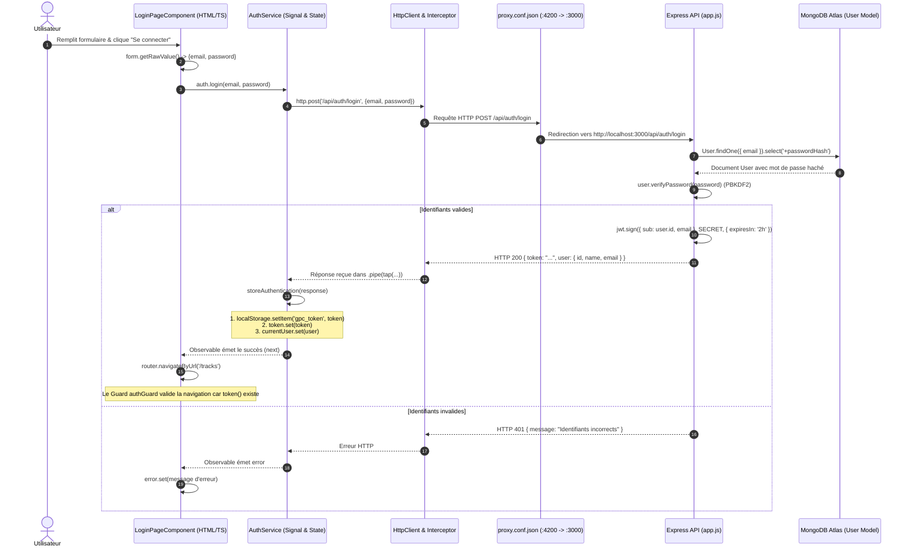

# Rapport TP1 — Architecture Authentification et Profil
**Guitar Practice Cloud — Package Étudiant M1 MIAGE**

---

## Mission 0 — Cartographier l'application

### 1. Cartographie de l'Application

#### 1.1. Point d'entrée et composant racine
- **Point d'entrée du bootstrap** : [`frontend-starter/src/main.ts`](frontend-starter/src/main.ts)
  - Utilise `bootstrapApplication(AppComponent, options)` spécifique aux architectures Angular standalone modernes (Angular 22).
  - Enregistre les deux providers vitaux : le routeur (`provideRouter(routes)`) et le client HTTP avec intercepteur (`provideHttpClient(withInterceptors([authInterceptor]))`).
- **Composant racine** : [`frontend-starter/src/app/components/app/app.ts`](frontend-starter/src/app/components/app/app.ts)
  - Sélecteur : `app-root` (relié à `index.html`).
  - Template : [`app.html`](frontend-starter/src/app/components/app/app.html) (affiche l'en-tête de navigation et la balise `<router-outlet />`).
  - Style : [`app.css`](frontend-starter/src/app/components/app/app.css).

#### 1.2. Configuration des routes et des guards
- **Table de routage** : [`frontend-starter/src/app/routes.ts`](frontend-starter/src/app/routes.ts)
  - `/` : redirection vers `/tracks`.
  - `/login` : composant `LoginPageComponent` (public).
  - `/register` : composant `RegisterPageComponent` (public).
  - `/profile` : composant `ProfilePageComponent` — **protégé** par `canActivate: [authGuard]`.
  - `/tracks` : composant `TracksPageComponent` — **protégé** par `canActivate: [authGuard]`.
  - `/**` : redirection de secours vers `/tracks`.
- **Guard fonctionnel** : [`frontend-starter/src/app/shared/guards/auth.guard.ts`](frontend-starter/src/app/shared/guards/auth.guard.ts)
  - Fonction `authGuard: CanActivateFn`.
  - Vérifie la présence du token via le signal `auth.token()`. S'il est absent, il redirige l'utilisateur vers `/login` via `router.createUrlTree(['/login'])`.

#### 1.3. Enregistrement de `HttpClient` et mécanisme d'ajout du JWT
- **Configuration** : Dans [`frontend-starter/src/main.ts`](frontend-starter/src/main.ts#L11) :
  ```typescript
  provideHttpClient(withInterceptors([authInterceptor]))
  ```
- **Intercepteur fonctionnel** : [`frontend-starter/src/app/shared/interceptors/auth.interceptor.ts`](frontend-starter/src/app/shared/interceptors/auth.interceptor.ts)
  - Fonction `authInterceptor: HttpInterceptorFn`.
  - Injecte `AuthService` avec `inject(AuthService)`.
  - Récupère le token réactif `const token = auth.token();`.
  - Si le token existe, clone la requête sortante en ajoutant l'en-tête HTTP :
    ```typescript
    request.clone({
      setHeaders: { Authorization: `Bearer ${token}` }
    })
    ```
  - Si aucun token n'existe, la requête est transmise sans modification.

#### 1.4. Modèles de données (`src/app/shared/models/`)
- [`user.model.ts`](frontend-starter/src/app/shared/models/user.model.ts) : Déclare l'interface `User` (`id`, `name`, `email`, `createdAt`).
- [`track.model.ts`](frontend-starter/src/app/shared/models/track.model.ts) : Déclare l'interface `Track` (`id`, `title`, `originalName`, `mimeType`, `size`, `createdAt`).
- [`auth-response.model.ts`](frontend-starter/src/app/shared/models/auth-response.model.ts) : Déclare l'interface `AuthResponse` (`token: string`, `user: User`).
- [`page.model.ts`](frontend-starter/src/app/shared/models/page.model.ts) : Déclare l'interface générique de pagination `Page<T>` (`items: T[]`, `page: number`, `limit: number`, `total: number`, `pages: number`).

#### 1.5. Services (`src/app/shared/services/`)
- [`auth.service.ts`](frontend-starter/src/app/shared/services/auth.service.ts) :
  - Centralise l'état d'authentification avec les signaux Angular :
    - `currentUser = signal<User | null>(null);`
    - `token = signal<string | null>(localStorage.getItem('gpc_token'));`
  - Méthodes HTTP : `login()`, `register()`, `profile()`, `update()`, `logout()`.
- [`track.service.ts`](frontend-starter/src/app/shared/services/track.service.ts) :
  - Centralise les opérations sur les pistes audio : `list(page, limit)`, `upload(file, title)`, `audio(id)`.

#### 1.6. Pages et composants (`src/app/components/`)
- `LoginPageComponent` ([`login-page/`](frontend-starter/src/app/components/login-page/)) : Formulaire réactif de connexion.
- `RegisterPageComponent` ([`register-page/`](frontend-starter/src/app/components/register-page/)) : Formulaire réactif de création de compte.
- `ProfilePageComponent` ([`profile-page/`](frontend-starter/src/app/components/profile-page/)) : Consultation et mise à jour du profil utilisateur.
- `TracksPageComponent` ([`tracks-page/`](frontend-starter/src/app/components/tracks-page/)) : Affichage de la bibliothèque paginée, upload de fichier et lecteur audio sécurisé.

---

### 2. Tableau des Routes : Publiques vs Protégées

Conformément à [`API_CONTRACT.md`](API_CONTRACT.md) et vérifié dans le code backend [`backend/src/app.js`](backend/src/app.js) :

| Méthode | Route HTTP | Protection | Middleware Backend | Données envoyées | Réponse attendue |
|---|---|---|---|---|---|
| **GET** | `/api/health` | **Publique** | Aucun | Aucune | `200 { status: "ok" }` |
| **POST** | `/api/auth/register` | **Publique** | Aucun | JSON `{ name, email, password }` | `201 { token, user }` |
| **POST** | `/api/auth/login` | **Publique** | Aucun | JSON `{ email, password }` | `200 { token, user }` |
| **GET** | `/api/users/me` | **Protégée** | `auth` (vérification JWT) | Header `Authorization: Bearer <token>` | `200 User` |
| **PUT** | `/api/users/me` | **Protégée** | `auth` (vérification JWT) | JSON `{ name }` + Header JWT | `200 User` |
| **GET** | `/api/tracks?page=1&limit=5` | **Protégée** | `auth` (vérification JWT) | Paramètres query + Header JWT | `200 Page<Track>` |
| **POST** | `/api/tracks` | **Protégée** | `auth` + `upload.single("audio")` | Multipart (`audio` + `title`) + Header JWT | `201 Track` |
| **GET** | `/api/tracks/:id/audio` | **Protégée** | `auth` (vérification JWT) | Paramètre `:id` + Header JWT | `200 Flux audio binaire` |
| **DELETE** | `/api/tracks/:id` | **Protégée** | `auth` (vérification JWT) | Paramètre `:id` + Header JWT | `204 No Content` |

> **Principe de protection backend** : Les routes protégées utilisent le middleware `auth` ([`backend/src/app.js`, lignes 56-77](backend/src/app.js#L56-L77)). Ce middleware extrait le header `Authorization`, vérifie la signature et l'expiration du JWT avec le secret serveur (`jwt.verify(raw.slice(7), SECRET)`), et injecte l'objet décodé dans `req.auth` (`req.auth.sub` contenant l'ID MongoDB de l'utilisateur).

---

### 3. Schéma Annoté du Flux lors d'un clic sur « Se connecter »

#### 3.1. Diagramme de séquence



#### 3.2. Description textuelle détaillée des étapes

1. **Interface Utilisateur** ([`login-page.html`](frontend-starter/src/app/components/login-page/login-page.html) & [`login-page.ts`](frontend-starter/src/app/components/login-page/login-page.ts#L27-L39)) :
   L'utilisateur clique sur le bouton de soumission. La méthode `submit()` extrait les données saisies via `this.form.getRawValue()`.
2. **Service Angular** ([`auth.service.ts`](frontend-starter/src/app/shared/services/auth.service.ts#L15-L19)) :
   Le composant délègue l'action à `AuthService.login(email, password)`. Le composant ne dialogue jamais directement avec l'API.
3. **Émission HTTP et Proxy** ([`proxy.conf.json`](frontend-starter/proxy.conf.json)) :
   `HttpClient.post()` envoie la requête vers `/api/auth/login`. Le serveur de dev Angular la relaie au backend Express sur `http://localhost:3000`.
4. **Traitement Express** ([`backend/src/app.js`](backend/src/app.js#L195-L220)) :
   Express intercepte la route `POST /api/auth/login`. Le middleware `express.json()` convertit le flux brut en objet JavaScript `req.body`.
5. **Recherche et Contrôle BDD** ([`backend/src/models/User.js`](backend/src/models/User.js)) :
   Mongoose recherche l'utilisateur avec `User.findOne({ email }).select('+passwordHash')`. La méthode `user.verifyPassword(password)` compare le mot de passe fourni avec le sel et le hachage PBKDF2 stockés dans MongoDB.
6. **Émission du JWT** ([`backend/src/app.js`](backend/src/app.js#L48-L53)) :
   Si les identifiants correspondent, la fonction `token(user)` signe un JWT avec une clé secrète serveur, contenant l'identifiant MongoDB (`sub`) et l'adresse email, avec une validité de 2 heures. Le backend renvoie `HTTP 200` avec `{ token, user: user.toPublic() }`.
7. **Mémorisation et Réactivité côté client** ([`auth.service.ts`](frontend-starter/src/app/shared/services/auth.service.ts#L45-L49)) :
   Grâce à l'opérateur RxJS `.pipe(tap(...))`, le service exécute `storeAuthentication()` :
   - `localStorage.setItem('gpc_token', response.token)` (persistance après rafraîchissement) ;
   - `this.token.set(response.token)` (Signal réactif) ;
   - `this.currentUser.set(response.user)` (Signal réactif).
8. **Redirection et Guard** ([`routes.ts`](frontend-starter/src/app/routes.ts) & [`auth.guard.ts`](frontend-starter/src/app/shared/guards/auth.guard.ts)) :
   Le composant reçoit la confirmation de succès et ordonne la navigation vers `/tracks`. Le guard `authGuard` vérifie `auth.token()` (qui est désormais vrai) et autorise l'accès.
9. **Requêtes Ultérieures** ([`auth.interceptor.ts`](frontend-starter/src/app/shared/interceptors/auth.interceptor.ts)) :
   Dès que `TracksPageComponent` est affiché, il appelle `TrackService.list()`. L'intercepteur `authInterceptor` intercepte automatiquement la requête sortante et y attache l'en-tête `Authorization: Bearer <token>`.

---

### 4. Réponses aux Questions Clés du Sujet

#### 4.1. Où s'effectue la tâche « mise à jour du profil utilisateur », dans quels fichiers côté back et côté front ?
- **Côté Frontend (Angular)** :
  1. [`frontend-starter/src/app/components/profile-page/profile-page.ts`](frontend-starter/src/app/components/profile-page/profile-page.ts#L26-L31) : La méthode `save()` récupère la valeur du formulaire réactif (`this.form.getRawValue().name`) et appelle `this.auth.update(...)`.
  2. [`frontend-starter/src/app/shared/services/auth.service.ts`](frontend-starter/src/app/shared/services/auth.service.ts#L33-L37) : La méthode `update(name)` effectue l'appel HTTP :
     ```typescript
     this.http.put<User>('/api/users/me', { name }).pipe(tap(user => this.currentUser.set(user)))
     ```
- **Côté Backend (Express / Mongoose)** :
  1. [`backend/src/app.js`](backend/src/app.js#L249-L268) : La route `app.put('/api/users/me', auth, ...)` protège l'endpoint avec le middleware `auth`, extrait `req.auth.sub` (l'identifiant utilisateur issu du JWT), et exécute la mise à jour :
     ```javascript
     const user = await User.findByIdAndUpdate(
       req.auth.sub,
       { $set: { name: req.body?.name } },
       { new: true, runValidators: true }
     );
     ```
  2. [`backend/src/models/User.js`](backend/src/models/User.js) : Valide les contraintes de schéma Mongoose et renvoie le profil mis à jour sans exposer de données sensibles via `.toPublic()`.

#### 4.2. Différence fondamentale entre Signal Angular et `localStorage`
- **Signal Angular** :
  - **Stockage** : Mémoire vive (RAM) du processus JavaScript dans l'onglet du navigateur.
  - **Réactivité** : **Immédiate et fine**. Lorsqu'un Signal change de valeur, Angular met automatiquement à jour uniquement les éléments du DOM qui en dépendent, sans redessiner toute la page.
  - **Persistance** : **Volatile**. Si l'utilisateur actualise la page (F5) ou ferme l'onglet, tous les signaux sont réinitialisés.
- **`localStorage`** :
  - **Stockage** : Mémoire persistante du navigateur sur le disque client (isolée par origine `http://localhost:4200`).
  - **Réactivité** : **Nulle**. Le `localStorage` est un stockage statique clé/valeur. Angular ne détecte pas nativement si une valeur y est modifiée.
  - **Persistance** : **Durable**. Les données survivent à la fermeture du navigateur et aux rafraîchissements de page.
- **Conclusion architecturale** : Le projet combine astucieusement les deux : le `localStorage` conserve le JWT pour éviter de redemander les identifiants au rechargement, tandis que le `Signal` apporte la réactivité à l'interface graphique.
