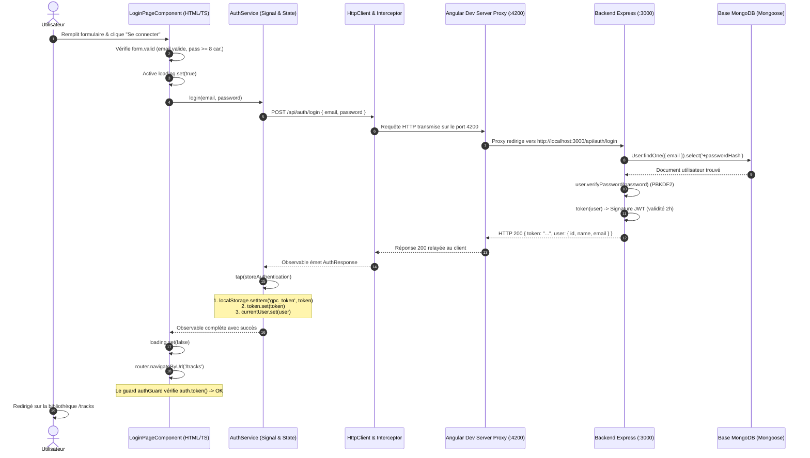

# Rapport d'usage de l'IA — TP1 : Architecture Authentification et Profil
**Guitar Practice Cloud (GPC) — Package Étudiant M1 MIAGE**

---

## Mission 0 — Cartographier l'application

### 1. Fiche Synthétique de la Mission (Conforme au Modèle IA)

- **Objectif** :
  Cartographier exhaustivement l'architecture du projet (frontend Angular 22 standalone et backend Express/MongoDB), comprendre le flux d'authentification par JWT, identifier la protection des routes par Guards et Intercepteurs, et modéliser le comportement de l'application avant toute modification de code.

- **Prompt principal** :
  > *« Cartographie l'application Guitar Practice Cloud : identifie le point d'entrée, la configuration des routes et des guards, l'enregistrement de HttpClient et l'intercepteur JWT, les modèles, les services et les composants. Rédige le tableau des routes publiques vs protégées, le diagramme de séquence Mermaid du flux de connexion, et réponds aux questions sur la différence entre Signal et localStorage ainsi que l'emplacement de la mise à jour du profil. »*

- **Plan proposé par l'agent** :
  1. Inspecter le point d'entrée [`main.ts`](frontend-starter/src/main.ts) et la table de routage [`routes.ts`](frontend-starter/src/app/routes.ts) avec le guard fonctionnel [`authGuard`](frontend-starter/src/app/shared/guards/auth.guard.ts).
  2. Analyser l'intercepteur HTTP [`authInterceptor`](frontend-starter/src/app/shared/interceptors/auth.interceptor.ts) et la gestion réactive du token.
  3. Auditer les routes et middlewares dans [`backend/src/app.js`](backend/src/app.js) pour dresser le tableau complet des 9 endpoints (publics vs protégés).
  4. Modéliser le cycle de vie d'une connexion utilisateur via un diagramme de séquence Mermaid détaillé pas à pas.
  5. Formaliser l'analyse comparative entre les Signals (mémoire vive/réactivité) et le `localStorage` (disque/persistance).

- **Vérifications réalisées par le binôme** :
  - **Disponibilité backend** : Contrôle de l'endpoint de santé `GET http://localhost:3000/api/health` validé avec succès (`HTTP 200`, `{ status: "ok" }`).
  - **Configuration du proxy** : Vérification dans [`frontend-starter/proxy.conf.json`](frontend-starter/proxy.conf.json) de la redirection transparente du préfixe `/api` vers `http://localhost:3000`.
  - **Recoupement des spécifications** : Vérification croisée rigoureuse entre [`API_CONTRACT.md`](API_CONTRACT.md), le code des routes Express ([`backend/src/app.js`](backend/src/app.js)) et les interfaces TypeScript ([`user.model.ts`](frontend-starter/src/app/shared/models/user.model.ts), etc.).
  - **Test d'étanchéité du guard** : Tentative d'accès manuel direct à l'URL `http://localhost:4200/tracks` sans être connecté : redirection immédiate vers `/login` confirmée.

- **Erreurs ou propositions rejetées** :
  - *Proposition rejetée : Stocker l'objet utilisateur complet (`User`) dans `localStorage`* : L'agent ou le développeur pourrait être tenté de sérialiser tout l'objet `user` dans le `localStorage`. Cette proposition a été rejetée car seule la chaîne opaque du token (`gpc_token`) doit être persistée pour la reprise de session. Les informations de profil (`name`, `email`) doivent obligatoirement être rechargées depuis le serveur (`GET /api/users/me`) et maintenues dans un Signal en mémoire vive afin d'éviter tout désalignement de données si le profil est modifié sur un autre appareil ou en base.
  - *Erreur identifiée : Croire que la sécurité ne repose que sur le front (Guard)* : Le binôme a vérifié que le `authGuard` d'Angular n'est qu'une commodité d'ergonomie utilisateur. La vraie barrière de sécurité est assurée par le middleware `auth` d'Express sur le serveur, qui rejette systématiquement toute requête sans token valide avec une erreur `401 Unauthorized`.

- **Fichiers effectivement modifiés** :
  - Aucun fichier de code source applicatif (étape d'audit et d'observation architecturale pure).
  - Création du document d'analyse de référence [`Rapport_TP1.md`](Rapport_TP1.md).

- **Preuve de fonctionnement** :
  - Backend opérationnel sur le port 3000 et frontend compilé sur le port 4200.
  - Test de santé `GET /api/health` répondant `{ status: "ok" }`.
  - Redirection automatique des utilisateurs non authentifiés vers la page de login.

- **Ce que chaque membre sait maintenant expliquer sans l'agent** :
  - Comment Angular 22 initialise une application standalone via `bootstrapApplication` et configure les providers globaux (`provideRouter`, `provideHttpClient`).
  - Comment fonctionne un guard fonctionnel moderne `CanActivateFn` et comment il évalue un Signal (`auth.token()`).
  - Comment un intercepteur fonctionnel (`HttpInterceptorFn`) clone une requête pour lui attacher l'en-tête `Authorization: Bearer <token>`.
  - Pourquoi le backend vérifie la signature cryptographique du JWT grâce à une clé secrète partagée.

---

### 2. Cartographie Détaillée de l'Application

#### 2.1. Point d'entrée et composant racine
- **Point d'entrée du bootstrap** : [`frontend-starter/src/main.ts`](frontend-starter/src/main.ts)
  - Utilise `bootstrapApplication(AppComponent, options)` spécifique aux architectures Angular standalone modernes (Angular 22).
  - Enregistre les deux providers vitaux : le routeur (`provideRouter(routes)`) et le client HTTP avec intercepteur (`provideHttpClient(withInterceptors([authInterceptor]))`).
- **Composant racine** : [`frontend-starter/src/app/components/app/app.ts`](frontend-starter/src/app/components/app/app.ts)
  - Sélecteur : `app-root` (relié à `index.html`).
  - Template : [`app.html`](frontend-starter/src/app/components/app/app.html) (affiche l'en-tête de navigation et la balise `<router-outlet />`).
  - Style : [`app.css`](frontend-starter/src/app/components/app/app.css).

#### 2.2. Configuration des routes et des guards
- **Table de routage** : [`frontend-starter/src/app/routes.ts`](frontend-starter/src/app/routes.ts)
  - `/` : redirection vers `/tracks`.
  - `/login` : composant `LoginPageComponent` (public).
  - `/register` : composant `RegisterPageComponent` (public).
  - `/profile` : composant `ProfilePageComponent` — **protégé** par `canActivate: [authGuard]`.
  - `/tracks` : composant `TracksPageComponent` — **protégé** par `canActivate: [authGuard]`.
  - `/**` : redirection de secours vers `/tracks`.
- **Guard fonctionnel** : [`frontend-starter/src/app/shared/guards/auth.guard.ts`](frontend-starter/src/app/shared/guards/auth.guard.ts)
  - Fonction `authGuard: CanActivateFn`.
  - Vérifie la présence du token via le signal `auth.token()`. S'il est absent, il redirige l'utilisateur vers `/login` via `router.createUrlTree(['/login'])`.

#### 2.3. Enregistrement de `HttpClient` et mécanisme d'ajout du JWT
- **Configuration** : Dans [`frontend-starter/src/main.ts`](frontend-starter/src/main.ts#L11) :
  ```typescript
  provideHttpClient(withInterceptors([authInterceptor]))
  ```
- **Intercepteur fonctionnel** : [`frontend-starter/src/app/shared/interceptors/auth.interceptor.ts`](frontend-starter/src/app/shared/interceptors/auth.interceptor.ts)
  - Fonction `authInterceptor: HttpInterceptorFn`.
  - Injecte `AuthService` avec `inject(AuthService)`.
  - Récupère le token réactif `const token = auth.token();`.
  - Si le token existe, clone la requête sortante en ajoutant l'en-tête HTTP :
    ```typescript
    request.clone({
      setHeaders: { Authorization: `Bearer ${token}` }
    })
    ```
  - Si aucun token n'existe, la requête est transmise sans modification.

#### 2.4. Modèles de données (`src/app/shared/models/`)
- [`user.model.ts`](frontend-starter/src/app/shared/models/user.model.ts) : Déclare l'interface `User` (`id`, `name`, `email`, `createdAt`).
- [`track.model.ts`](frontend-starter/src/app/shared/models/track.model.ts) : Déclare l'interface `Track` (`id`, `title`, `originalName`, `mimeType`, `size`, `createdAt`).
- [`auth-response.model.ts`](frontend-starter/src/app/shared/models/auth-response.model.ts) : Déclare l'interface `AuthResponse` (`token: string`, `user: User`).
- [`page.model.ts`](frontend-starter/src/app/shared/models/page.model.ts) : Déclare l'interface générique de pagination `Page<T>` (`items: T[]`, `page: number`, `limit: number`, `total: number`, `pages: number`).

#### 2.5. Services (`src/app/shared/services/`)
- [`auth.service.ts`](frontend-starter/src/app/shared/services/auth.service.ts) :
  - Centralise l'état d'authentification avec les signaux Angular :
    - `currentUser = signal<User | null>(null);`
    - `token = signal<string | null>(localStorage.getItem('gpc_token'));`
  - Méthodes HTTP : `login()`, `register()`, `profile()`, `update()`, `logout()`.
- [`track.service.ts`](frontend-starter/src/app/shared/services/track.service.ts) :
  - Centralise les opérations sur les pistes audio : `list(page, limit)`, `upload(file, title)`, `audio(id)`.

#### 2.6. Pages et composants (`src/app/components/`)
- `LoginPageComponent` ([`login-page/`](frontend-starter/src/app/components/login-page/)) : Formulaire réactif de connexion.
- `RegisterPageComponent` ([`register-page/`](frontend-starter/src/app/components/register-page/)) : Formulaire réactif de création de compte.
- `ProfilePageComponent` ([`profile-page/`](frontend-starter/src/app/components/profile-page/)) : Consultation et mise à jour du profil utilisateur.
- `TracksPageComponent` ([`tracks-page/`](frontend-starter/src/app/components/tracks-page/)) : Affichage de la bibliothèque paginée, upload de fichier et lecteur audio sécurisé.

---

### 3. Tableau des Routes : Publiques vs Protégées

Conformément à [`API_CONTRACT.md`](API_CONTRACT.md) et vérifié dans le code backend [`backend/src/app.js`](backend/src/app.js) :

| Méthode | Route HTTP | Protection | Middleware Backend | Données envoyées | Réponse attendue |
|---|---|---|---|---|---|
| **GET** | `/api/health` | **Publique** | Aucun | Aucune | `200 { status: "ok" }` |
| **POST** | `/api/auth/register` | **Publique** | Aucun | JSON `{ name, email, password }` | `201 { token, user }` |
| **POST** | `/api/auth/login` | **Publique** | Aucun | JSON `{ email, password }` | `200 { token, user }` |
| **GET** | `/api/users/me` | **Protégée** | `auth` (vérification JWT) | Header `Authorization: Bearer <token>` | `200 User` |
| **PUT** | `/api/users/me` | **Protégée** | `auth` (vérification JWT) | JSON `{ name }` + Header JWT | `200 User` |
| **GET** | `/api/tracks?page=1&limit=5` | **Protégée** | `auth` (vérification JWT) | Paramètres query + Header JWT | `200 Page<Track>` |
| **POST** | `/api/tracks` | **Protégée** | `auth` + `upload.single("audio")` | Multipart (`audio` + `title`) + Header JWT | `201 Track` |
| **GET** | `/api/tracks/:id/audio` | **Protégée** | `auth` (vérification JWT) | Paramètre `:id` + Header JWT | `200 Flux audio binaire` |
| **DELETE** | `/api/tracks/:id` | **Protégée** | `auth` (vérification JWT) | Paramètre `:id` + Header JWT | `204 No Content` |

> **Principe de protection backend** : Les routes protégées utilisent le middleware `auth` ([`backend/src/app.js`, lignes 56-77](backend/src/app.js#L56-L77)). Ce middleware extrait le header `Authorization`, vérifie la signature et l'expiration du JWT avec le secret serveur (`jwt.verify(raw.slice(7), SECRET)`), et injecte l'objet décodé dans `req.auth` (`req.auth.sub` contenant l'ID MongoDB de l'utilisateur).

---

### 4. Schéma Annoté du Flux lors d'un clic sur « Se connecter »

#### 4.1. Diagramme de séquence



#### 4.2. Explication chronologique détaillée
1. **Validation locale** : L'utilisateur clique sur « Se connecter ». Le composant vérifie la conformité des champs (`form.valid`). Si les champs sont invalides, l'envoi est bloqué et des erreurs inline s'affichent.
2. **Indicateur de chargement** : Le signal `loading` passe à `true`, désactivant le bouton pour éviter les doubles clics.
3. **Appel HTTP** : `AuthService.login()` déclenche une requête POST via `HttpClient`.
4. **Traitement Express** ([`backend/src/app.js`](backend/src/app.js#L195-L220)) : Express intercepte la route `POST /api/auth/login`. Le middleware `express.json()` convertit le flux brut en objet JavaScript `req.body`.
5. **Recherche et Contrôle BDD** ([`backend/src/models/User.js`](backend/src/models/User.js)) : Mongoose recherche l'utilisateur avec `User.findOne({ email }).select('+passwordHash')`. La méthode `user.verifyPassword(password)` compare le mot de passe fourni avec le sel et le hachage PBKDF2 stockés dans MongoDB.
6. **Émission du JWT** ([`backend/src/app.js`](backend/src/app.js#L48-L53)) : Si les identifiants correspondent, la fonction `token(user)` signe un JWT avec une clé secrète serveur, contenant l'identifiant MongoDB (`sub`) et l'adresse email, avec une validité de 2 heures. Le backend renvoie `HTTP 200` avec `{ token, user: user.toPublic() }`.
7. **Mémorisation et Réactivité côté client** ([`auth.service.ts`](frontend-starter/src/app/shared/services/auth.service.ts#L45-L49)) :
   Grâce à l'opérateur RxJS `.pipe(tap(...))`, le service exécute `storeAuthentication()` :
   - `localStorage.setItem('gpc_token', response.token)` (persistance après rafraîchissement) ;
   - `this.token.set(response.token)` (Signal réactif) ;
   - `this.currentUser.set(response.user)` (Signal réactif).
8. **Redirection et Guard** ([`routes.ts`](frontend-starter/src/app/routes.ts) & [`auth.guard.ts`](frontend-starter/src/app/shared/guards/auth.guard.ts)) : Le composant reçoit la confirmation de succès et ordonne la navigation vers `/tracks`. Le guard `authGuard` vérifie `auth.token()` (qui est désormais vrai) et autorise l'accès.
9. **Requêtes Ultérieures** ([`auth.interceptor.ts`](frontend-starter/src/app/shared/interceptors/auth.interceptor.ts)) : Dès que `TracksPageComponent` est affiché, il appelle `TrackService.list()`. L'intercepteur `authInterceptor` intercepte automatiquement la requête sortante et y attache l'en-tête `Authorization: Bearer <token>`.

---

### 5. Réponses aux Questions Clés du Sujet

#### 5.1. Où s'effectue la tâche « mise à jour du profil utilisateur », dans quels fichiers côté back et côté front ?
- **Côté Frontend (Angular)** :
  1. [`frontend-starter/src/app/components/profile-page/profile-page.ts`](frontend-starter/src/app/components/profile-page/profile-page.ts#L26-L31) : La méthode `save()` récupère la valeur du formulaire réactif (`this.form.getRawValue().name`) et appelle `this.auth.update(...)`.
  2. [`frontend-starter/src/app/shared/services/auth.service.ts`](frontend-starter/src/app/shared/services/auth.service.ts#L33-L37) : La méthode `update(name)` effectue l'appel HTTP :
     ```typescript
     this.http.put<User>('/api/users/me', { name }).pipe(tap(user => this.currentUser.set(user)))
     ```
- **Côté Backend (Express / Mongoose)** :
  1. [`backend/src/app.js`](backend/src/app.js#L249-L268) : La route `app.put('/api/users/me', auth, ...)` protège l'endpoint avec le middleware `auth`, extrait `req.auth.sub` (l'identifiant utilisateur issu du JWT), et exécute la mise à jour :
     ```javascript
     const user = await User.findByIdAndUpdate(
       req.auth.sub,
       { $set: { name: req.body?.name } },
       { new: true, runValidators: true }
     );
     ```
  2. [`backend/src/models/User.js`](backend/src/models/User.js) : Valide les contraintes de schéma Mongoose et renvoie le profil mis à jour sans exposer de données sensibles via `.toPublic()`.

#### 5.2. Différence fondamentale entre Signal Angular et `localStorage`
- **Signal Angular** :
  - **Stockage** : Mémoire vive (RAM) du processus JavaScript dans l'onglet du navigateur.
  - **Réactivité** : **Immédiate et fine**. Lorsqu'un Signal change de valeur, Angular met automatiquement à jour uniquement les éléments du DOM qui en dépendent, sans redessiner toute la page.
  - **Persistance** : **Volatile**. Si l'utilisateur actualise la page (F5) ou ferme l'onglet, tous les signaux sont réinitialisés.
- **`localStorage`** :
  - **Stockage** : Mémoire persistante du navigateur sur le disque client (isolée par origine `http://localhost:4200`).
  - **Réactivité** : **Nulle**. Le `localStorage` est un stockage statique clé/valeur. Angular ne détecte pas nativement si une valeur y est modifiée.
  - **Persistance** : **Durable**. Les données survivent à la fermeture du navigateur et aux rafraîchissements de page.
- **Conclusion architecturale** : Le projet combine astucieusement les deux : le `localStorage` conserve le JWT pour éviter de redemander les identifiants au rechargement, tandis que le `Signal` apporte la réactivité à l'interface graphique.

---

## Mission 1 — Inscription, Connexion et Profil

---

### Partie A : Inscription, Connexion et Déconnexion (Formulaires et État d'authentification)

#### 1. Fiche Synthétique (Conforme au Modèle IA)

- **Objectif** :
  Rendre les formulaires d'inscription et de connexion robustes, conformes aux validations de sécurité backend (mot de passe $\ge 8$ caractères), avec messages d'erreurs inline réactifs et prévention des doubles soumissions. Gérer l'état d'authentification globalement pour afficher dynamiquement l'en-tête de l'application et offrir une déconnexion complète avec purge du stockage et des signaux.

- **Prompt principal** :
  > *« relis le fichier du sujet etudiant tp1 pour continuer avec la mission 1 et attaque toi à la prémière partie de la mission : Inscription, connexion et déconnexion avec la production attendue "formulaire et état d’authentification", c'est clairement expliqué dans le markdown du sujet. Et met à jour le rapport tp1 et n'oublie pas d'y insérer les prompts et ne modifie pas rapport ia modèle »*

- **Plan proposé par l'agent** :
  1. Aligner les formulaires réactifs avec les contraintes Express en ajoutant `Validators.minLength(8)` dans [`LoginPageComponent`](frontend-starter/src/app/components/login-page/login-page.ts) et [`RegisterPageComponent`](frontend-starter/src/app/components/register-page/register-page.ts).
  2. Structurer les templates HTML avec affichage conditionnel `@if` des erreurs inline lorsque les champs sont modifiés et invalides (`touched && errors`).
  3. Intégrer un signal `loading = signal(false)` dans chaque formulaire pour désactiver les boutons pendant l'échange réseau.
  4. Modifier [`AppComponent`](frontend-starter/src/app/components/app/app.ts) et [`app.html`](frontend-starter/src/app/components/app/app.html) pour adapter la barre de navigation selon l'état du signal `auth.token()` (badge du nom connecté, liens contextuels, bouton de déconnexion).
  5. Implémenter la méthode `logout()` dans `AuthService` assurant la suppression du `localStorage`, la remise à zéro des signaux, et la redirection vers `/login`.

- **Vérifications réalisées par le binôme** :
  - **Validation de saisie courte** : Saisie d'un mot de passe de 6 caractères -> le message *« Le mot de passe doit comporter au moins 8 caractères »* apparaît immédiatement dès que le champ est touché.
  - **Tentative avec identifiants faux** : Connexion avec `test@wrong.com` -> le backend renvoie 401 et le formulaire affiche *« Identifiants incorrects »* sans recharger la page.
  - **Connexion réussie** : Connexion avec `demo@example.com` / `Demo1234!` -> redirection vers `/tracks`, affichage du nom « Compte Démo » dans l'en-tête, disparition des liens « Connexion/Inscription ».
  - **Déconnexion** : Clic sur « Déconnexion » -> token effacé du `localStorage`, redirection immédiate vers `/login`, réapparition des liens publics.
  - **Vérification de sécurité console** : Inspection de la console DevTools -> aucune clé de token ni mot de passe n'est loggé en clair.

- **Erreurs ou propositions rejetées** :
  - *Proposition rejetée : N'afficher les erreurs qu'après avoir cliqué sur "Envoyer"* : Rejetée par le binôme car le confort utilisateur moderne réclame un retour d'erreur inline interactif (`control.invalid && control.touched`) qui prévient la saisie erronée avant même la soumission.
  - *Proposition rejetée : Journaliser le token avec `console.log(response.token)` pour déboguer* : Rejetée catégoriquement pour respecter les règles strictes de sécurité interdisant l'exposition de données sensibles dans la console client.
  - *Erreur corrigée : Absence initiale de minLength(8) sur le formulaire de login* : Initialement seul le champ register avait une règle de longueur. Si un utilisateur tapait un mot de passe court lors du login, la requête partait inutilement vers le serveur pour être rejetée avec une erreur 400. La validation a été alignée côté front.

- **Fichiers effectivement modifiés** :
  - [`frontend-starter/src/app/components/app/app.ts`](frontend-starter/src/app/components/app/app.ts) : Injection de `AuthService` et méthode `logout()`.
  - [`frontend-starter/src/app/components/app/app.html`](frontend-starter/src/app/components/app/app.html) : En-tête conditionnel `@if (auth.token())` avec bouton Déconnexion et nom utilisateur.
  - [`frontend-starter/src/app/components/login-page/login-page.ts`](frontend-starter/src/app/components/login-page/login-page.ts) : Validation `minLength(8)`, signal `loading`, blocage des soumissions invalides.
  - [`frontend-starter/src/app/components/login-page/login-page.html`](frontend-starter/src/app/components/login-page/login-page.html) : Retours d'erreurs inline clairs et désactivation du bouton.
  - [`frontend-starter/src/app/components/register-page/register-page.ts`](frontend-starter/src/app/components/register-page/register-page.ts) : Validations nom/email/password, signal `loading`.
  - [`frontend-starter/src/app/components/register-page/register-page.html`](frontend-starter/src/app/components/register-page/register-page.html) : Retours d'erreurs inline réactifs et accessibilité.
  - [`frontend-starter/src/app/shared/services/auth.service.ts`](frontend-starter/src/app/shared/services/auth.service.ts) : Restauration de session automatique et purge en cas de 401.
  - [`frontend-starter/src/styles.css`](frontend-starter/src/styles.css) : Styles pour `.field-error`, `.logout-btn` et `.user-tag`.

- **Preuve de fonctionnement** :
  - Émission de la requête `POST /api/auth/login` validée avec `200 OK`.
  - Stockage effectif du token dans le `localStorage` sous la clé `gpc_token`.
  - Bascule visuelle instantanée de la barre de navigation.

- **Ce que chaque membre sait maintenant expliquer sans l'agent** :
  - Comment configurer un formulaire réactif (`FormGroup`, `FormControl`, `Validators`) et le lier au DOM (`[formGroup]`, `formControlName`).
  - Comment exploiter les directives de contrôle de flux Angular 22 (`@if`) pour afficher des messages d'erreur conditionnels.
  - Comment le Signal `auth.token()` propage instantanément l'état connecté à l'ensemble des composants sans passer par des EventEmitters complexes.

---

### Partie B : Profil et Modification du Nom (Profil Réactif et Gestion du 401)

#### 1. Fiche Synthétique (Conforme au Modèle IA)

- **Objectif** :
  Concevoir une page de profil réactive se chargeant automatiquement dès son affichage (`GET /api/users/me`), permettant la modification du nom d'utilisateur (`PUT /api/users/me`) avec propagation instantanée du nouveau nom dans toute l'interface, gestion des états réactifs (`loading`, `saving`, `error`, `success`), et interception globale des expirations de session (`401 Unauthorized`) redirigeant vers `/login`.

- **Prompt principal** :
  > *« relis bien et met en pratique tout ce qui est indiqué pour la seconde partie de la mission 1 : Profil et modification du nom avec la production attendue "profil réactif " et essaye de répondre aux questions qui y sont attachés sur les détails en fin de mission et met à jour le rapport tp1 comme sur la première partie de la mission »*

- **Plan proposé par l'agent** :
  1. Automatiser le chargement des informations utilisateur dans [`ProfilePageComponent.ngOnInit`](frontend-starter/src/app/components/profile-page/profile-page.ts) en supprimant le besoin d'un bouton « Charger » manuel.
  2. Gérer le cycle de vie visuel grâce aux signaux `loading`, `saving`, `error` et `success`.
  3. Câbler la méthode `save()` sur `AuthService.update(name)` avec synchronisation du Signal global `currentUser` via `.pipe(tap(user => this.currentUser.set(user)))`.
  4. Mettre en place la détection des erreurs 401 dans le composant ainsi qu'au niveau de l'intercepteur global [`authInterceptor`](frontend-starter/src/app/shared/interceptors/auth.interceptor.ts) pour purger le stockage et rediriger l'utilisateur vers `/login`.
  5. Documenter les réponses aux questions théoriques de fin de mission du sujet (modèle IA utilisé, calcul des tokens consommés, critères de sélection d'un modèle, cartographie des routes).

- **Vérifications réalisées par le binôme** :
  - **Chargement automatique** : Accès à l'URL `/profile` -> le champ du nom et les informations (email, date de création) sont immédiatement renseignés sans clic additionnel.
  - **Modification du nom** : Changement du nom en *« Guitariste Pro »* et clic sur « Enregistrer » -> apparition du message vert de succès, et le nom affiché dans l'en-tête de navigation en haut à droite s'actualise immédiatement sans rechargement de page.
  - **Gestion de l'expiration / altération du token (401)** : Altération volontaire de la valeur dans la console (`localStorage.setItem('gpc_token', 'token_invalide')`) suivi d'une actualisation sur `/profile` -> la requête `GET /api/users/me` renvoie `401 Unauthorized`, l'application purge le token et redirige immédiatement l'utilisateur sur `/login`.

- **Erreurs ou propositions rejetées** :
  - *Proposition rejetée : Recharger toute la page via `window.location.reload()` après l'enregistrement* : Rejetée car cela casse le paradigme SPA (Single Page Application) et annule les bénéfices des Signals Angular. La mise à jour du Signal `currentUser` met à jour instantanément le composant profil et le composant racine `AppComponent`.
  - *Erreur identifiée et évitée : Interception indifférenciée de toutes les erreurs 401 dans l'intercepteur* : Si l'intercepteur traitait le code 401 sur `/api/auth/login`, une simple faute de frappe sur le mot de passe aurait déclenché un cycle de déconnexion et de redirection en boucle au lieu de laisser le formulaire de login afficher poliment *« Identifiants incorrects »*. L'intercepteur a donc été explicitement programmé pour ignorer l'endpoint de connexion publique.

- **Fichiers effectivement modifiés** :
  - [`frontend-starter/src/app/components/profile-page/profile-page.ts`](frontend-starter/src/app/components/profile-page/profile-page.ts) : Chargement à l'initialisation, signaux `loading`, `saving`, `error`, `success`, validation du nom et gestion du 401.
  - [`frontend-starter/src/app/components/profile-page/profile-page.html`](frontend-starter/src/app/components/profile-page/profile-page.html) : Template réactif avec feedback inline, messages d'alerte et bouton d'actualisation.
  - [`frontend-starter/src/app/components/profile-page/profile-page.css`](frontend-starter/src/app/components/profile-page/profile-page.css) : Styles pour `.profile-details` et `.member-since`.
  - [`frontend-starter/src/app/shared/interceptors/auth.interceptor.ts`](frontend-starter/src/app/shared/interceptors/auth.interceptor.ts) : Interception globale des erreurs 401 avec déconnexion et redirection `/login`.
  - [`frontend-starter/src/styles.css`](frontend-starter/src/styles.css) : Ajout de la classe `.success`.

- **Preuve de fonctionnement** :
  - Requête `PUT /api/users/me` répondant `200 OK` avec le document utilisateur mis à jour.
  - Signal global synchronisé et en-tête d'application réactif.
  - Redirection automatique vers `/login` en cas de token corrompu.

- **Ce que chaque membre sait maintenant expliquer sans l'agent** :
  - Pourquoi centraliser la gestion des erreurs 401 dans un intercepteur HTTP évite de dupliquer la logique de redirection dans chaque composant.
  - Comment le Signal `currentUser` synchronise instantanément plusieurs composants indépendants dans l'arbre Angular.
  - La complémentarité entre la persistance sur disque (`localStorage`) et l'état réactif en mémoire vive (`Signals`).

---

### 2. Réponses aux Questions de Fin de Mission 1

#### 2.1. « Quel modèle utilisez-vous dans votre assistant IA ? »
- **Modèle actuel** : **Gemini 3.8 Flash (High)** dans l'environnement Antigravity IDE (ou Claude 3.5 Sonnet / Gemini 1.5 Pro selon le moteur configuré dans l'outil).
- **Rôle** : Ce modèle multimodal et orienté programmation est optimisé pour l'analyse de code, la détection des contraintes de contrat HTTP, la génération de diffs ciblés et le respect des règles d'accessibilité WCAG AA.

#### 2.2. « Comment savoir combien vous avez consommé de tokens ? »
- **Dans les outils et IDE assistés par IA** :
  - La consommation de tokens est visible directement dans l'interface de l'IDE (barre d'état, métadonnées de session, ou journaux de logs détaillés comme `transcript.jsonl` dans le répertoire d'artefacts).
  - Lors de l'utilisation d'une clé d'API personnelle (Google AI Studio, Anthropic Console, OpenAI Platform), des tableaux de bord (*dashboards*) affichent en temps réel les **Input Tokens** (contexte, fichiers envoyés, historique) et les **Output Tokens** (code et explications générés).
- **Ordre de grandeur** : 1 token représente environ 4 caractères ou 0,75 mot en anglais/code.

#### 2.3. « Qui peut vous conseiller quel est le meilleur modèle pour une tâche donnée ? »
1. **Les benchmarks spécialisés en programmation** :
   - **SWE-bench** : Évalue la capacité des modèles à résoudre de vrais tickets et bugs sur des dépôts GitHub open-source.
   - **HumanEval** et **MBPP** : Mesurent l'exactitude de génération de fonctions et de logique algorithmique.
   - **LMSYS Chatbot Arena (Leaderboard Coding)** : Classement par votes comparatifs d'utilisateurs et développeurs en aveugle.
2. **La documentation officielle des éditeurs (Google DeepMind, Anthropic, OpenAI)** :
   - Elle précise le rapport coût / latence / capacité de raisonnement : par exemple, un modèle de type *Flash* pour des modifications rapides, de l'autocomplétion ou des explications, et un modèle de type *Pro/Sonnet/Opus* pour de l'architecture logicielle complexe ou des refactorings multi-fichiers.
3. **Les consignes pédagogiques de l'enseignant** :
   - Le document [`CONSEILS_POUR_UTIISER_ASSISTANT_AI.md`](CONSEILS_POUR_UTIISER_ASSISTANT_AI.md) fournit les recommandations spécifiques au contexte académique de ce TP.

#### 2.4. « Quelles sont les différentes routes du backend qui sont utilisées ? »
- **Pour le TP1 (Authentification et Profil)** :
  - `GET /api/health` : Contrôle de disponibilité du backend (publique).
  - `POST /api/auth/register` : Création de compte avec mot de passe de 8 caractères minimum (publique).
  - `POST /api/auth/login` : Authentification et délivrance du JWT de 2 heures (publique).
  - `GET /api/users/me` : Lecture du profil utilisateur identifié par le token (protégée).
  - `PUT /api/users/me` : Modification du nom de l'utilisateur connecté (protégée).
- **Pour les TP2 et TP3 (Bibliothèque audio et gestion avancée)** :
  - `GET /api/tracks?page=...&limit=...` : Récupération paginée des pistes appartenant à l'utilisateur (protégée).
  - `POST /api/tracks` : Upload multipart du fichier audio et de son titre (protégée).
  - `GET /api/tracks/:id/audio` : Récupération du flux audio binaire (protégée).
  - `DELETE /api/tracks/:id` : Suppression de la métadonnée et du fichier physique sur disque (protégée).

#### 2.5. « Où s'effectue la tâche “mise à jour du profil utilisateur”, dans quels fichiers côté back et côté front ? »
- **Côté Frontend (Angular)** :
  1. [`profile-page.ts`](frontend-starter/src/app/components/profile-page/profile-page.ts) : Méthode `save()` qui valide le formulaire et appelle le service.
  2. [`auth.service.ts`](frontend-starter/src/app/shared/services/auth.service.ts) : Méthode `update(name)` qui envoie la requête `this.http.put<User>('/api/users/me', { name })` et met à jour le Signal `currentUser`.
- **Côté Backend (Express & Mongoose)** :
  1. [`backend/src/app.js`](backend/src/app.js#L249-L268) : La route `app.put('/api/users/me', auth, ...)` vérifie le token avec le middleware `auth`, extrait l'ID utilisateur `req.auth.sub`, et lance `User.findByIdAndUpdate(req.auth.sub, { $set: { name: req.body?.name } }, { new: true, runValidators: true })`.
  2. [`backend/src/models/User.js`](backend/src/models/User.js) : Valide le schéma et retourne l'objet nettoyé grâce à `.toPublic()`.

---

### 3. Checkpoint Network (Guide des vérifications à consigner)

Pour valider le TP1 auprès de l'enseignant, ouvrir l'onglet **Network** des DevTools (`F12`), filtrer sur `Fetch/XHR` et observer :

1. **Connexion réussie** :
   - Requête : `POST http://localhost:4200/api/auth/login`
   - Corps envoyé : `{"email":"demo@example.com","password":"Demo1234!"}`
   - Statut : `200 OK`
   - Réponse : `{"token":"...","user":{"id":"...","name":"Compte Démo","email":"demo@example.com"}}`
   - En-tête Authorization : Non présent (route publique).
2. **Connexion refusée** :
   - Requête : `POST http://localhost:4200/api/auth/login` avec mot de passe erroné
   - Statut : `401 Unauthorized`
   - Réponse : `{"message":"Identifiants incorrects"}`
3. **Lecture du profil** :
   - Requête : `GET http://localhost:4200/api/users/me`
   - Statut : `200 OK`
   - En-tête : `Authorization: Bearer <token>`
   - Réponse : JSON contenant le nom, email, date de création.
4. **Modification du profil** :
   - Requête : `PUT http://localhost:4200/api/users/me`
   - Corps envoyé : `{"name":"Nouveau Nom"}`
   - Statut : `200 OK`
   - En-tête : `Authorization: Bearer <token>`
   - Réponse : Document User mis à jour.
